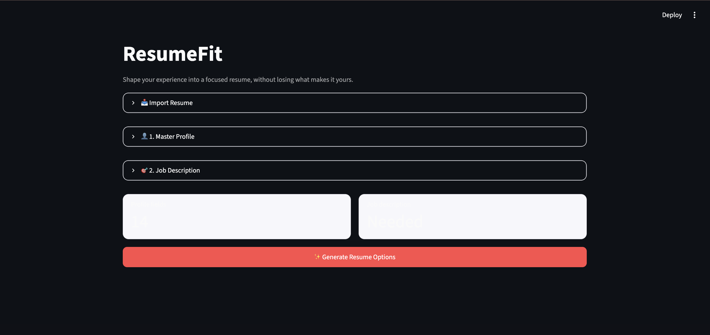
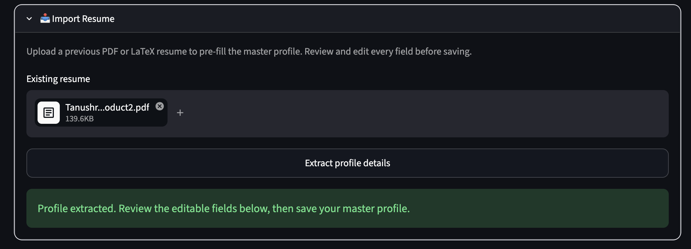
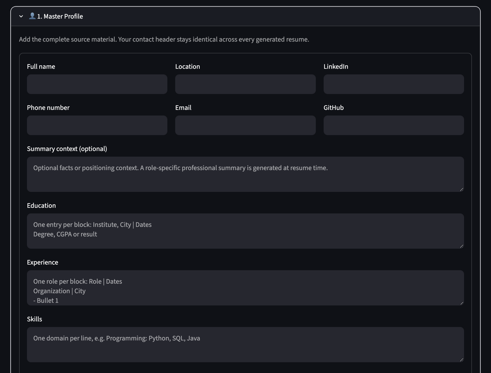
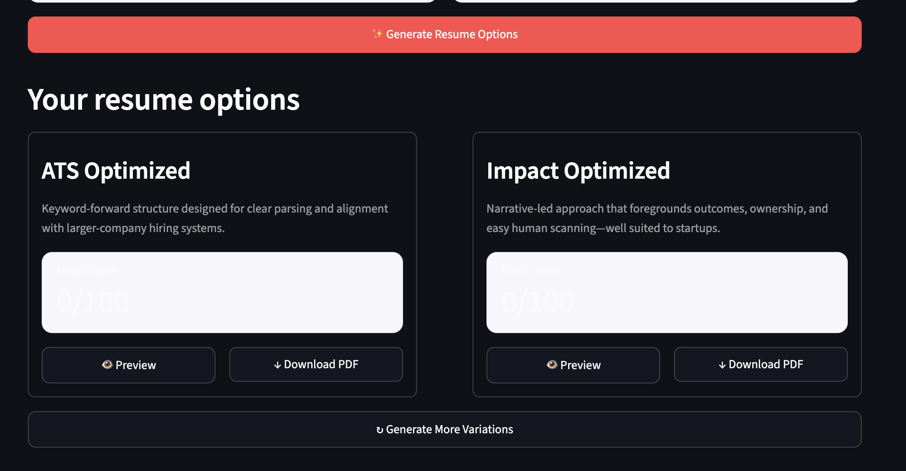
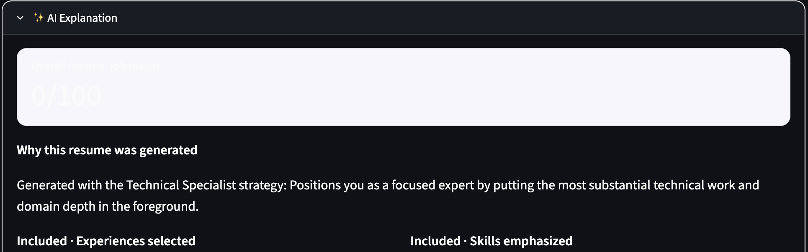
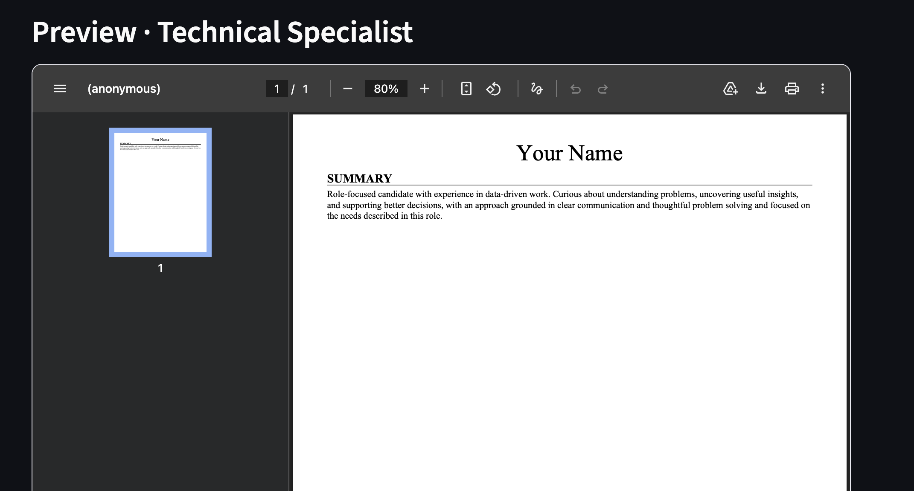

# ResumeFit – AI Resume Tailoring Platform

## Overview

ResumeFit is an AI-powered application that helps job seekers tailor their resumes for specific job descriptions. Instead of submitting the same resume for every application, users can import their master resume, analyze a target job description, and generate optimized resume versions based on different application strategies.

The platform also explains why certain experiences, skills, and projects were selected, making the resume generation process transparent and easier to understand.

---

## Problem Statement

Many candidates apply to multiple jobs using a single generic resume, leading to poor ATS compatibility and lower interview conversion rates.

ResumeFit solves this problem by intelligently matching resumes with job descriptions, identifying relevant experiences and skills, and generating personalized resumes optimized for different hiring scenarios.

---

## Key Features

### Resume Import

- Upload an existing resume
- Extract structured candidate information
- Create a reusable master profile

### Master Profile Management

- Store personal information, education, experience, projects, and skills
- Edit and reuse profile information for future applications

### Job Description Analysis

- Analyze job descriptions
- Extract important keywords and required skills
- Identify role-specific requirements

### AI Resume Generation

Generate multiple resume versions, including:

- ATS Optimized
- Impact Optimized
- Technical Specialist
- Builder & Owner

Each version prioritizes different experiences while remaining factually accurate.

### Explainable AI Recommendations

For every generated resume, the platform provides:

- Why experiences were selected
- Matching skills and keywords
- Missing keywords
- Resume-job alignment insights

### Resume Export

- Generate professional one-page resumes
- Export as PDF
- Maintain clean and consistent formatting

---

## Technology Stack

- Python
- Streamlit
- PyPDF
- ReportLab
- JSON
- Regular Expressions (Regex)

---

## Project Structure

```
resume-fit/

├── app.py
├── profile.json
├── requirements.txt
├── README.md
├── .gitignore
├── .env.example
│
└── screenshots/
    ├── home_page.png
    ├── import_resume.png
    ├── master_profile.png
    ├── strategy_options.png
    ├── ai_explanation.png
    └── generated_resume.png
```

---

# Screenshots

## Home Page



---

## Import Resume



---

## Master Profile



---

## Resume Strategy Generation



---

## AI Explanation



---

## Generated Resume Preview



---

## Future Enhancements

- ATS score prediction
- Cover letter generation
- LinkedIn profile optimization
- Multi-role resume recommendations
- AI interview preparation
- Cloud profile synchronization

---

## Repository Note

Sensitive configuration files and API credentials have been excluded from the public repository. Configure environment variables using the provided `.env.example` template before running the application.
